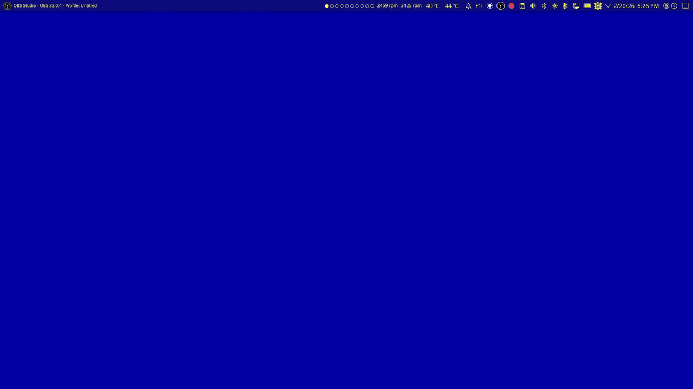

# Kröhnkite-i3

A dynamic tiling extension for KWin 6 only.

Krohnkite-i3 is a fork of [Kröhnkite](https://codeberg.org/anametologin/Krohnkite) that specifically implements i3 style tiling
to the KDE plasma desktop environment.



The main motivation for this fork came from the fact that there was no other tiler which could provide i3 style tiling inside of KDE Plasma other than just hacking out kwin and replacing it with i3 under X11 sessions which broke a lot of window management features. 

Krohnkite by [anametologin](https://codeberg.org/anametologin) did come close, however it only supported layouts of other tiling window managers (dwm, bspwm). The reason why I went out of my way to delete a lot of other layouts by krohnkite was to make it easier for me to navigate through the project and built up on it. 

If you require the other layouts, then it would be better to revert back to anametologin's Krohnkite.

## Features

- [x] i3 style splitting (vertical and horizontal)
- [ ] Window Shifting/Movement
- [ ] Nested container tree
- [ ] alternative layouts
  - [ ] stack
  - [ ] tabbed

## Development Requirement

- Typescript (see package.json)
- [go-task](https://github.com/go-task/task)
- p7zip (7z)

## Look at me

1. If you change the Krohnkite co nfiguration, you will need to reboot. Do not toggle the script on and off, this will start multiple instances of it.
2. Delete unused KWin shortcuts you can use any D-Bus program which can invoke D-Bus methods. Service name -`org.kde.kglobalaccel` path - `/component/kwin` method - `org.kde.kglobalaccel.Component.cleanUp`. ArchLinux example:

```
qdbus6 org.kde.kglobalaccel /component/kwin org.kde.kglobalaccel.Component.cleanUp
```

3. If you have a gap or vice versa you have gray(white etc) rectangle that means that there is a program with size 1x1 that have to be filtered by title or other ways. Make sure that the following programs, if you have them, have been added to the filter:

```
xwaylandvideobridge,plasmashell,ksplashqml
```

## Installation

You can install Kröhnkite in multiple ways.

### Using .kwinscript package file

You can download `krohnkite-x.x.x.x.kwinscript` file, and install it through
_System Settings_.

1. Download the kwinscript file
2. Open `System Settings` > `Window Management` > `KWin Scripts`
3. Press `Import KWin script...` on the top-right corner
4. Select the downloaded file

Alternatively, through command-line:
get info about package:

```
kpackagetool6 -t KWin/Script -s krohnkite
```

install:

```
kpackagetool6 -t KWin/Script -i krohnkite-x.x.x.x.kwinscript
```

upgrade:

```
kpackagetool6 -t KWin/Script -u krohnkite-x.x.x.x.kwinscript
```

uninstall:

```
kpackagetool6 -t KWin/Script -r krohnkite
```

### Installing from Git repository

Make sure you have [go-task](https://taskfile.dev/installation/), [npm](https://docs.npmjs.com/downloading-and-installing-node-js-and-npm) and [7-zip](https://www.7-zip.org/download.html) packages installed. All packages after building will be in `builds` folder.
The simplest method to automatically build and install kwinscript package would be:

```
 go-task install
```

You can also build `.kwinscript` package file using:

```
go-task package
```

uninstall package:

```
go-task uninstall
```

## Settings

### Add a class name, a resource name or a window caption to ignore or float

1. to found window's className,resourcename or caption see [readme](https://github.com/anametologin/krohnkite#search-a-window-parameters-to-filter-float-etc)
2. you can use the name of class in square brackets: `[myNamE]` will float or ignore all windows with class or resource names such: 'myname1', 'Myname2', 'Notmyname555' etc...

## Default Key Bindings

| Key              | Action             |
| ---------------- | ------------------ |
| Meta + C         | Split Horizontally |
| Meta + V         | Split Vertically   |
|                  |                    |
| Meta + .         | Focus Next         |
| Meta + ,         | Focus Previous     |
|                  |                    |
| Meta + J         | Focus Down         |
| Meta + K         | Focus Up           |
| Meta + H         | Focus Left         |
| Meta + L         | Focus Right        |
|                  |                    |
| Meta + Shift + J | Move Down/Next     |
| Meta + Shift + K | Move Up/Previous   |
| Meta + Shift + H | Move Left          |
| Meta + Shift + L | Move Right         |
|                  |                    |
| Meta + I         | Increase           |
| Meta + D         | Decrease           |
| Meta + F         | Toggle Floating    |
| Meta + \         | Next Layout        |
| Meta + \|        | Previous Layout    |
|                  |                    |
| Meta + Return    | Set as Master      |
|                  |                    |

## Tips

### Setting Up for Multi-Screen

Krohnkite supports multi-screen setup, but KWin has to be configured to unlock
the full potential of the script.

1. Enable `Separate Screen Focus` feature:

- `System Settings` > `Window Management` > `Window Behavior` > `Multiscreen Behaviour`

  `OR` use console commands:

```
   kwriteconfig6 --file ~/.config/kwinrc --group Windows --key ActiveMouseScreen false
   kwriteconfig6 --file ~/.config/kwinrc --group Windows --key SeparateScreenFocus true
```

2. Bind keys for global shortcut `Switch to Next/Previous Screen`
   (Recommend: `Meta + ,` / `Meta + .`)
3. Bind keys for global shortcut `Window to Next/Previous Screen`
   (Recommend: `Meta + <` / `Meta + >`)

### Removing Title Bars

Breeze window decoration can be configured to completely remove title bars from
all windows:

1. `System Setting` > `Application Style` > `Window Decorations`
2. Click `Configure Breeze` inside the decoration preview.
3. `Window-Specific Overrides` tab > `Add` button
4. Enter the followings, and press `Ok`:
   - `Regular expression to match`: `.*`
   - Tick `Hide window title bar`

### Changing Border Colors

Changing the border color makes it easier to identify current window. This is
convinient if title bars are removed.

1. You can use the Oxygen decoration theme. [Oxygen theme settings][]
2. You can install third-party decorations, see [Border color conversation][]
3. You can add to the WM section in $HOME/.config/kdeglobals (this changes the default Breeze decoration frame colors):
   - `frame=R,G,B`
   - `inactiveFrame=R,G,B`

[Oxygen theme settings]: https://github.com/anametologin/krohnkite/assets/165245883/51b4cb48-33c7-4627-a119-33d1abbe2b99
[Border color conversation]: https://github.com/anametologin/krohnkite/issues/15

### Setting Minimum Geometry Size

Some applications like discord and KDE settings dont tile nicely as they have a minimum size requirement.
This causes the applications to overlap with other applications. To mitigate this we can set minimum size for all windows to be 0.

1. `System Setting` > `Window Management` > `Window Rules`
2. Click on `+ Add New...`
3. Set `Window class` to be `Unimportant`
4. Set `Window types` to `Normal Window`
5. Click `+ Add Properties...`
6. Add the `Minimum Size` Property
7. Set the fields to `Force` and `0` x `0`
8. Apply

### Prevent borders and shadows from disappearing

When a window is marked "maximized" in Breeze theme, its borders are removed to save screen space.
This behavior may not be preferable depending on your setup. This can be mitigated by disabling maximized windows using Window Rules.

1. `System Setting` > `Window Management` > `Window Rules`
2. Click on `+ Add New...`
3. Set `Window class` to be `Unimportant`
4. Set `Window types` to `Normal Window`
5. Click `+ Add Properties...`
6. Add the `Maximized horizontally` and `Maximized vertically` Properties.
7. Set the options to `Force` and `No`.
8. Apply

## Useful Development Resources

- [KWin Scripting Tutorial](https://develop.kde.org/docs/plasma/kwin/)
- [KWin Scripting API](https://develop.kde.org/docs/plasma/kwin/api/)
- Adding configuration dialog
  - [Development/Tutorials/Plasma/JavaScript/ConfigDialog](https://techbase.kde.org/Development/Tutorials/Plasma/JavaScript/ConfigDialog)
  - [Development/Tutorials/Using KConfig XT](https://techbase.kde.org/Development/Tutorials/Using_KConfig_XT)
- `*.ui` files can be edited with [Qt Designer](http://doc.qt.io/qt-5/qtdesigner-manual.html).
  It's very straight-forward if you're used to UI programming.
